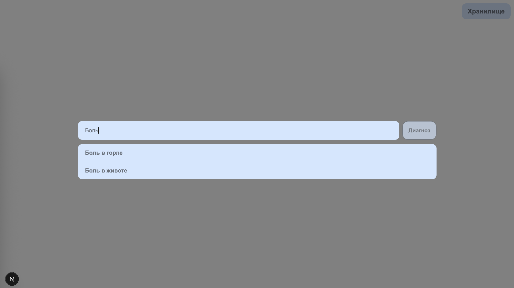
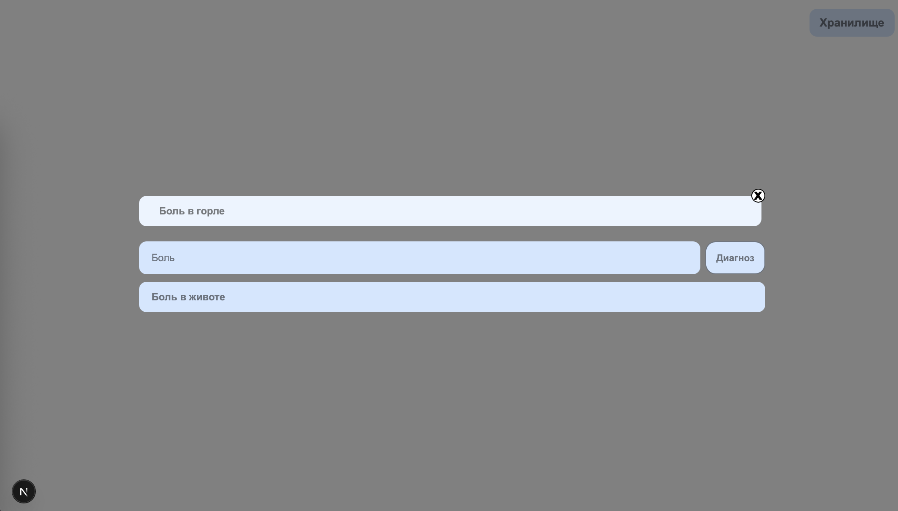
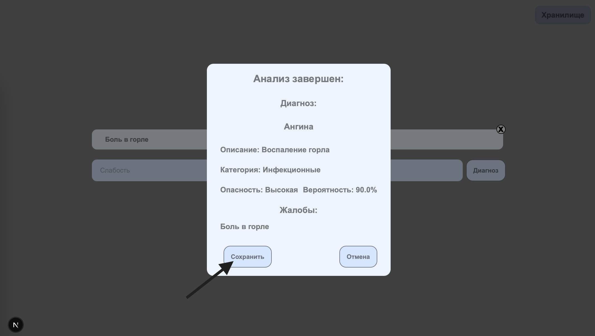
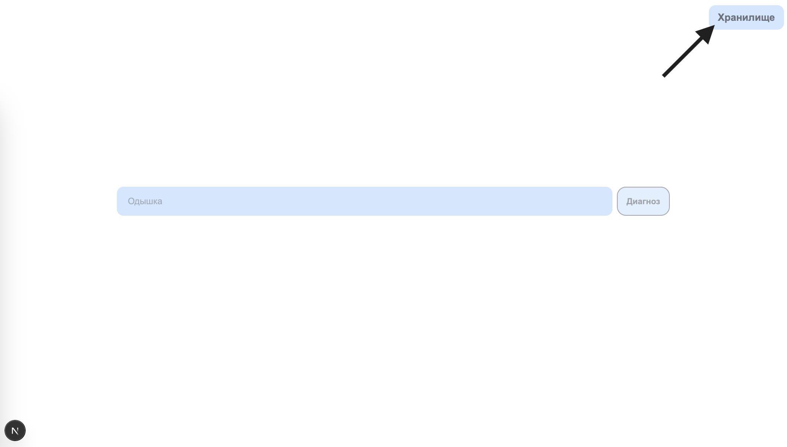
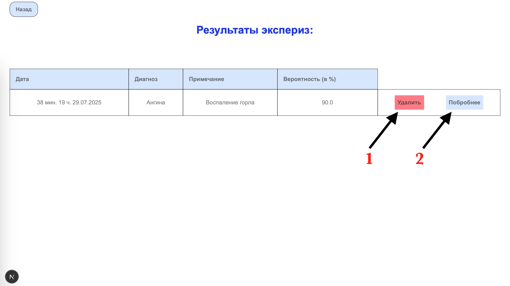

# Медицинская экспертная система на Next.js


[Ссылка на Демо Vercel](https://med-expert-system-frontend.vercel.app/)

## ❗Важное уведомление о работе системы
#### Данная экспертная система является вспомогательным инструментом для диагностики заболеваний и не может заменить профессиональную медицинскую консультацию.

## Описание
Frontend часть медицинской экспертной системы для диагностики заболеваний на основе симптомов.

## Технологический стек
1. Next.js
2. Tailwind
3. Redux Toolkit
4. RTK Query
5. Redux Persist

## Настройка и запуск

1. Клонирование репозитория
```
git clone https://github.com/ArtKonX/med-expert-system-frontend.git
```

2. Установка зависимостей
```
yarn install
```

3. Создайте файл .env.local в корне проекта
```
NEXT_PUBLIC_BACKEND_URL=http://localhost:7070
```

4. Запуск
```
yarn dev
```

## Основные функции приложения:
1. Поиск симптомов(если симптом уже выбран он сохраняется в localStorage для дальнейшей отправки на сервер со следующим запросом, чтобы он не дублировался)


2. Выбор симптомов


3. Удаление симптома на крестик в правом верхнем углу выбранного симптома

4. Получение анлиза исследования по нажатию на кнопку 'Диагноз'

5. Сохранение анализа в SQLite на сервере или отмена


6. Переход на страницу с сохраненными анализами(хранилище)


7. Удаление анализа (см. на рис.) под номером 1 и развернутый анализ под номером 2 (на странице хранилища)


### Команда разработчиков
<a href="https://github.com/ArtKonX" >ArtKonX</a> — ведущий разработчик проекта